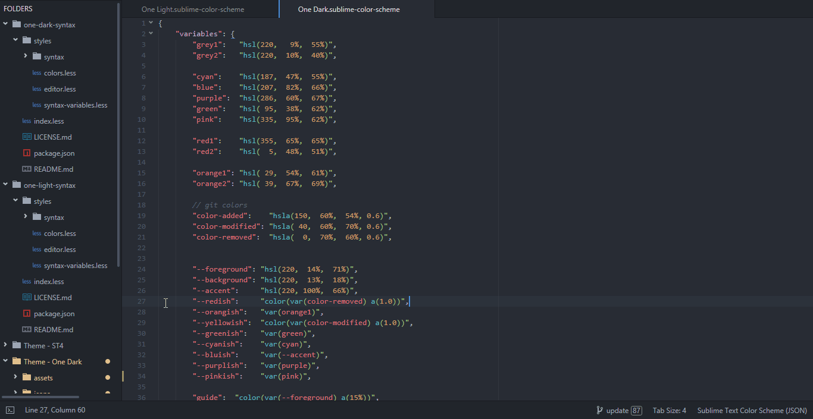

# Incremental Diff

A plugin to quickly diff two views through Sublime text's built-in Incremental Diff.

## Usage

The plugin provides these commands:
- `set_reference_document`: available in the context and tab context menus and the command palette,
	opens a quick panel with these options to set the contents as a reference for the incremental diff:
	* "Clipboard": Use the clipboard.
	* "Open Views": opens a quick panel with all suitable open views (excluding images and possibly binary files).
	* "File Dialog": Pick a file from a file dialog (ST4 only).

- `set_reference_document_from_file`: available in the Side Bar context menu, when exactly two files are selected, the file on which the menu is invoked will be opened if not already open, and the other file's contents will be used as a reference for incremental diff.

- `reset_reference_document`: resets the reference document of the active view; you can bind it to a key, it's not bound by default.

- `toggle_all_diffs`: bonus command, available in the context menu, shows/hides all diff hunks in the view.

## Installation

Open the Command Palette, select `Package Control: Install Package` and search for `IncrementalDiff`.